# Discovery Workflow

```mermaid
flowchart TB
    subgraph Entry["🚀 Entry Points"]
        CMD_NEW["/discover 'description'"]
        CMD_RESUME["/discover --resume"]
        CMD_ABORT["/discover --abort"]
    end

    subgraph SessionCheck["Session Management"]
        CHECK_SESSION{{"Session existe ?"}}
        LOAD_SESSION["Charger session"]
        NEW_SESSION["Nouvelle session"]
        ARCHIVE["Archiver ancienne"]
    end

    subgraph Phase1["Phase 1 — Problème"]
        P1_Q1["❓ Quel problème ?"]
        P1_Q2["❓ Pour qui ?"]
        P1_Q3["❓ Comment géré aujourd'hui ?"]
        P1_Q4["❓ Pourquoi maintenant ?"]
        P1_VALIDATE{{"Critères sortie ✓"}}
        P1_SAVE[("💾 Save session")]
    end

    subgraph Phase2["Phase 2 — Contraintes"]
        P2_Q1["❓ Contraintes techniques ?"]
        P2_Q2["❓ Contraintes business ?"]
        P2_Q3["❓ Qu'est-ce qui te ferait échouer ?"]
        P2_Q4["❓ Négociable vs non-négociable ?"]
        P2_VALIDATE{{"Critères sortie ✓"}}
        P2_SAVE[("💾 Save session")]
    end

    subgraph Checkpoint["🔍 Checkpoint Mi-Parcours"]
        CP_EVAL{{"Recommander récap ?"}}
        CP_PROPOSE["Proposer récap"]
        CP_USER{{"Choix utilisateur"}}
        CP_RECAP["Afficher récap Phases 1-2"]
        CP_ADJUST["Ajuster"]
        CP_PIVOT["Pivoter"]
        CP_PAUSE["Pause → Save partial"]
    end

    subgraph Phase3["Phase 3 — Stack"]
        P3_SYNTH["Synthétiser contraintes"]
        P3_PROPOSE["Proposer stack mappée"]
        P3_CONFLICT{{"Contradiction ?"}}
        P3_SIGNAL["⚠️ Signaler conflit"]
        P3_VALIDATE{{"Critères sortie ✓"}}
        P3_SAVE[("💾 Save session")]
    end

    subgraph Phase4["Phase 4 — Architecture"]
        P4_Q1["❓ Monolithe ou services ?"]
        P4_Q2["❓ Composants principaux ?"]
        P4_Q3["❓ Communication ?"]
        P4_ASCII["📊 Générer schéma ASCII"]
        P4_VALIDATE{{"Critères sortie ✓"}}
        P4_SAVE[("💾 Save session")]
    end

    subgraph Phase5["Phase 5 — Scope"]
        P5A["5a: MVP Features"]
        P5A_CHECK{{"MVP > 8 ?"}}
        P5A_FORCE["Forcer priorisation"]
        P5B["5b: Exclusions"]
        P5B_CHECK{{"≥ 1 exclusion ?"}}
        P5B_FORCE["Exiger 1 minimum"]
        P5C["5c: Risques"]
        P5C_CHECK{{"Risques = 0 ?"}}
        P5C_CHALLENGE["Challenge: 'Vraiment aucun ?'"]
        P5_VALIDATE{{"Critères sortie ✓"}}
        P5_SAVE[("💾 Save session")]
    end

    subgraph Phase6["Phase 6 — Synthèse"]
        P6_GEN["Générer discovery.md"]
        P6_COMPLETE{{"Complétude OK ?"}}
        P6_MISSING["Retour phase manquante"]
        P6_COHERENCE{{"Cohérence OK ?"}}
        P6_CONFLICT_RESOLVE["Résoudre incohérences"]
        P6_AUTOCRIT_EVAL{{"Recommander auto-critique ?"}}
        P6_AUTOCRIT["Auto-critique"]
        P6_FINAL["📄 discovery.md final"]
    end

    subgraph ResearchGate["🔬 Research Gate"]
        RG_DETECT{{"Déclencheur détecté ?"}}
        RG_PROPOSE["Proposer A/B/C"]
        RG_USER{{"Choix utilisateur"}}
        RG_QUICK["Mode Quick"]
        RG_SPAWN_Q["Spawn agent quick"]
        RG_EXEC["Exécuter web search"]
        RG_INTEGRATE["Intégrer résultats"]
        RG_DEEP["Mode Deep"]
        RG_SPAWN_D["Spawn agent deep"]
        RG_DISPLAY["Afficher prompt"]
        RG_SAVE_RG["Sauvegarder session"]
        RG_WAIT["⏸️ Pause — attente résultats"]
        RG_SKIP["Ajouter aux questions ouvertes"]
    end

    subgraph Validation["🔎 Agents Validation"]
        VAL_AGENT["discovery-validator"]
        VAL_COMPLETE["Check complétude"]
        VAL_COHER["Check cohérence"]
    end

    subgraph Bootstrap["🏗️ Bootstrap"]
        BOOT_CMD["/bootstrap --from-discovery"]
        BOOT_PARSE["Parser discovery.md"]
        BOOT_VALIDATE{{"Discovery valide ?"}}
        BOOT_ADR_EVAL{{"Conditions ADR ?"}}
        BOOT_GEN_AGENT["discovery-generator"]
        BOOT_OUTPUT["Structure projet"]
    end

    subgraph Output["📦 Outputs"]
        OUT_CLAUDE["CLAUDE.md < 60 lignes"]
        OUT_SPEC["SPEC.md lean"]
        OUT_DOCS["docs/agent_docs/"]
        OUT_ADR["docs/adr/0001-*.md"]
        OUT_STRUCTURE["Structure projet §4"]
    end

    subgraph Limits["⚠️ Limites & Guards"]
        LIM_LOOP{{"Loop > 5 questions ?"}}
        LIM_RETRY{{"Retours > 3 ?"}}
        LIM_TOTAL{{"Total > 30 ?"}}
        LIM_TIME{{"Durée > 45 min ?"}}
        LIM_RESEARCH{{"Recherches > quota ?"}}
        LIM_ABANDON["Proposer abandon"]
        LIM_PARTIAL["Save partial"]
    end

    %% Entry flows
    CMD_NEW --> NEW_SESSION
    CMD_RESUME --> CHECK_SESSION
    CMD_ABORT --> |"Supprimer session"| END_ABORT["🛑 Fin"]

    CHECK_SESSION --> |Oui| LOAD_SESSION
    CHECK_SESSION --> |Non| NEW_SESSION
    LOAD_SESSION --> |"Reprendre"| P1_Q1

    %% Phase 1 flow
    NEW_SESSION --> P1_Q1
    P1_Q1 --> P1_Q2 --> P1_Q3 --> P1_Q4
    P1_Q4 --> P1_VALIDATE
    P1_VALIDATE --> |"❌ Incomplet"| P1_Q1
    P1_VALIDATE --> |"✅"| P1_SAVE --> P2_Q1

    %% Phase 2 flow
    P2_Q1 --> P2_Q2 --> P2_Q3 --> P2_Q4
    P2_Q4 --> P2_VALIDATE
    P2_VALIDATE --> |"❌"| P2_Q1
    P2_VALIDATE --> |"✅"| P2_SAVE --> CP_EVAL

    %% Checkpoint
    CP_EVAL --> |"Clarifications ou > 5 contraintes"| CP_PROPOSE
    CP_EVAL --> |"Flow clair"| P3_SYNTH
    CP_PROPOSE --> CP_USER
    CP_USER --> |"Continuer"| P3_SYNTH
    CP_USER --> |"Récap"| CP_RECAP --> CP_USER
    CP_USER --> |"Ajuster"| CP_ADJUST --> P1_Q1
    CP_USER --> |"Pivoter"| CP_PIVOT --> NEW_SESSION
    CP_USER --> |"Pause"| CP_PAUSE --> LIM_PARTIAL

    %% Phase 3 flow (avec Research Gate)
    P3_SYNTH --> P3_CONFLICT
    P3_CONFLICT --> |"Oui"| P3_SIGNAL --> P3_PROPOSE
    P3_CONFLICT --> |"Non"| P3_PROPOSE
    P3_PROPOSE -.-> RG_DETECT
    RG_DETECT --> |"Oui"| RG_PROPOSE
    RG_DETECT --> |"Non"| P3_VALIDATE
    RG_PROPOSE --> RG_USER
    RG_USER --> |"A: Rapide"| RG_QUICK --> RG_SPAWN_Q --> RG_EXEC --> RG_INTEGRATE --> P3_VALIDATE
    RG_USER --> |"B: Deep"| RG_DEEP --> RG_SPAWN_D --> RG_DISPLAY --> RG_SAVE_RG --> RG_WAIT
    RG_USER --> |"C: Skip"| RG_SKIP --> P3_VALIDATE
    P3_VALIDATE --> |"❌"| P3_PROPOSE
    P3_VALIDATE --> |"✅"| P3_SAVE --> P4_Q1

    %% Phase 4 flow
    P4_Q1 --> P4_Q2 --> P4_Q3 --> P4_ASCII
    P4_ASCII --> P4_VALIDATE
    P4_VALIDATE --> |"❌ Pas de schéma"| P4_ASCII
    P4_VALIDATE --> |"✅"| P4_SAVE --> P5A

    %% Phase 5 flow (avec Research Gate sur 5c)
    P5A --> P5A_CHECK
    P5A_CHECK --> |"> 8"| P5A_FORCE --> P5A
    P5A_CHECK --> |"≤ 8"| P5B
    P5B --> P5B_CHECK
    P5B_CHECK --> |"0"| P5B_FORCE --> P5B
    P5B_CHECK --> |"≥ 1"| P5C
    P5C --> P5C_CHECK
    P5C_CHECK --> |"0 + complexe"| P5C_CHALLENGE --> P5C
    P5C -.-> RG_DETECT
    P5C_CHECK --> |"OK"| P5_VALIDATE
    P5_VALIDATE --> |"✅"| P5_SAVE --> P6_GEN

    %% Phase 6 flow
    P6_GEN --> VAL_AGENT
    VAL_AGENT --> VAL_COMPLETE --> P6_COMPLETE
    P6_COMPLETE --> |"❌ Requis manquant"| P6_MISSING --> P1_Q1
    P6_COMPLETE --> |"⚠️ Recommandé manquant"| VAL_COHER
    P6_COMPLETE --> |"✅"| VAL_COHER
    VAL_COHER --> P6_COHERENCE
    P6_COHERENCE --> |"❌ Incohérence"| P6_CONFLICT_RESOLVE
    P6_CONFLICT_RESOLVE --> |"Ajuster"| P3_SYNTH
    P6_CONFLICT_RESOLVE --> |"Accepter risque"| P6_AUTOCRIT_EVAL
    P6_COHERENCE --> |"✅"| P6_AUTOCRIT_EVAL
    P6_AUTOCRIT_EVAL --> |"MVP > 8 ou 0 risques"| P6_AUTOCRIT --> P6_FINAL
    P6_AUTOCRIT_EVAL --> |"Projet simple"| P6_FINAL

    %% "Je ne sais pas" → Research Gate (toutes phases)
    P1_Q1 -.-> |"Je ne sais pas"| RG_DETECT
    P2_Q1 -.-> |"Je ne sais pas"| RG_DETECT

    %% Bootstrap flow
    P6_FINAL --> BOOT_CMD
    BOOT_CMD --> BOOT_PARSE --> BOOT_VALIDATE
    BOOT_VALIDATE --> |"❌"| P6_GEN
    BOOT_VALIDATE --> |"✅"| BOOT_ADR_EVAL
    BOOT_ADR_EVAL --> |"Stack non-standard"| BOOT_GEN_AGENT
    BOOT_ADR_EVAL --> |"Stack standard"| BOOT_GEN_AGENT
    BOOT_GEN_AGENT --> BOOT_OUTPUT

    %% Outputs
    BOOT_OUTPUT --> OUT_CLAUDE
    BOOT_OUTPUT --> OUT_SPEC
    BOOT_OUTPUT --> OUT_DOCS
    BOOT_ADR_EVAL --> |"Conditions remplies"| OUT_ADR
    BOOT_OUTPUT --> OUT_STRUCTURE

    %% Limits (connected to all phases)
    P1_Q4 -.-> LIM_LOOP
    P2_Q4 -.-> LIM_LOOP
    P3_PROPOSE -.-> LIM_LOOP
    P4_Q3 -.-> LIM_LOOP
    P5C -.-> LIM_LOOP
    LIM_LOOP --> |"Oui"| LIM_ABANDON
    LIM_RETRY --> |"Oui"| LIM_ABANDON
    LIM_TOTAL --> |"Oui"| LIM_PARTIAL
    LIM_TIME --> |"Oui"| LIM_PARTIAL
    LIM_RESEARCH --> |"Oui"| LIM_PARTIAL
    LIM_ABANDON --> |"Pause"| LIM_PARTIAL
    LIM_PARTIAL --> END_PARTIAL["📄 discovery.md partiel"]

    %% Styling
    classDef phase fill:#e1f5fe,stroke:#01579b
    classDef validation fill:#fff3e0,stroke:#e65100
    classDef output fill:#e8f5e9,stroke:#2e7d32
    classDef checkpoint fill:#fce4ec,stroke:#880e4f
    classDef limit fill:#ffebee,stroke:#c62828
    classDef agent fill:#f3e5f5,stroke:#7b1fa2
    classDef research fill:#e8eaf6,stroke:#283593

    class P1_Q1,P1_Q2,P1_Q3,P1_Q4,P2_Q1,P2_Q2,P2_Q3,P2_Q4,P3_SYNTH,P3_PROPOSE,P4_Q1,P4_Q2,P4_Q3,P4_ASCII,P5A,P5B,P5C,P6_GEN phase
    class P1_VALIDATE,P2_VALIDATE,P3_VALIDATE,P4_VALIDATE,P5_VALIDATE,P6_COMPLETE,P6_COHERENCE,BOOT_VALIDATE validation
    class OUT_CLAUDE,OUT_SPEC,OUT_DOCS,OUT_ADR,OUT_STRUCTURE,P6_FINAL,BOOT_OUTPUT output
    class CP_EVAL,CP_PROPOSE,CP_USER,CP_RECAP checkpoint
    class LIM_LOOP,LIM_RETRY,LIM_TOTAL,LIM_TIME,LIM_RESEARCH,LIM_ABANDON,LIM_PARTIAL limit
    class VAL_AGENT,BOOT_GEN_AGENT agent
    class RG_DETECT,RG_PROPOSE,RG_USER,RG_QUICK,RG_SPAWN_Q,RG_EXEC,RG_INTEGRATE,RG_DEEP,RG_SPAWN_D,RG_DISPLAY,RG_SAVE_RG,RG_WAIT,RG_SKIP research
```



---

## Changelog v3

> **Modifications appliquées depuis v2**, issues de l'intégration du système de recherche :
> 
> 1. **Research Gates intégrés nativement** — Les points de décision en Phase 3 (Stack), Phase 5c (Risques) et toute situation "je ne sais pas" bloquante déclenchent un Research Gate proposant 3 options : recherche rapide, Deep Research (Claude Desktop), ou skip.
> 2. **Nouvel agent `research-prompt-agent`** — Agent spécialisé sans interaction utilisateur qui lit `discovery-session.md` et génère des prompts de recherche optimisés (Deep Research XML ≤ 300 mots, ou queries web search 1-6 mots).
> 3. **Research Log dans la session** — `discovery-session.md` intègre un journal de recherche (type, mode, statut, résumé) et une section `Pending Research` pour les recherches Deep en attente.
> 4. **Reprise avec recherche pending** — `/discover --resume` détecte automatiquement les recherches Deep en attente et propose d'intégrer les résultats, relancer le prompt, ou skip.
> 5. **Limite de recherche par session** — 3 deep + 5 quick max pour éviter la paralysis by analysis.
> 6. **Gestion "je ne sais pas" en 3 temps** — Évaluation d'impact (bloquant/non-bloquant), Research Gate si bloquant, accumulation dans les questions ouvertes sinon.

---

## 1. Vue d'ensemble

### 1.1 Objectif

Remplacer les templates de projet figés par un workflow discovery-first interactif qui génère une documentation projet complète et personnalisée avant la création du PRD.

**Note** : `discovery.md` est un document intermédiaire (pré-PRD) qui consolide les choix fondamentaux du projet. Il sert de base pour générer le `SPEC.md` lean (exploitable directement par Claude Code pour le TDD) et optionnellement un PRD complet avec acceptance criteria, metrics SMART, etc.

### 1.2 Flow global

```
/discover "description projet"
      ↓
⏱️ Interview guidée (6 phases, objectif < 45 min)
  ├── Research Gates aux points de décision
  │   ├── Quick search (web search intégrée, ~30s)
  │   └── Deep Research (prompt optimisé → Claude Desktop, 15-45 min)
      ↓
Validations multi-niveaux
      ↓
discovery.md finalisé (7 sections)
      ↓
/bootstrap --from-discovery
      ↓
Structure projet générée (avec SPEC.md lean)
      ↓
/prd --from-discovery (optionnel — projets complexes > 5 features MVP)
```

### 1.3 Principes fondamentaux

|Principe|Application|
|---|---|
|Une question à la fois|Jamais de questions multiples dans un message|
|Proposer, ne pas imposer|Claude suggère, l'utilisateur décide|
|Progressive disclosure|Complexité révélée au fur et à mesure|
|Traçabilité|Toutes les décisions capturées dans discovery.md|
|Résilience|Sauvegarde auto, reprise possible|
|Efficience temporelle|Discovery < 45 min, save-partial si dépassement|
|Recherche au bon moment|Proposer la recherche quand elle débloque, pas systématiquement|

---

## 2. Les 6 Phases d'Interview

### 2.1 Phase 1 — Problème

**Objectif** : Comprendre le quoi, pour qui, et la situation actuelle.

**Questions types** :

- Quel problème résous-tu ?
- Pour qui ? (utilisateurs cibles)
- Comment c'est géré aujourd'hui ? (situation actuelle)
- Pourquoi maintenant ? (déclencheur)

**Output** : Section §1 de discovery.md

**Critères de sortie** :

- [ ] Problème formulable en 1 phrase (pattern "X ne peut pas Y à cause de Z")
- [ ] Utilisateur cible nommable (pas "les utilisateurs")
- [ ] Douleur quantifiable ou observable
- [ ] Motivation claire

---

### 2.2 Phase 2 — Contraintes

**Objectif** : Identifier ce qui est fixé vs ce qui est ouvert.

**Questions types** :

- Contraintes techniques imposées ? (langage, hosting, infra existante)
- Contraintes business ? (budget, timeline, compliance)
- Contraintes personnelles ? (stack connue, préférences)
- Qu'est-ce qui est négociable vs non-négociable ?
- **Qu'est-ce qui te ferait échouer ?** (fait émerger les contraintes implicites)

**Template de capture** :

|Contrainte|Type|Négociable ?|Impact sur stack|
|---|---|---|---|
|AWS only|Infra|Non|Hosting, services|
|Budget < 50€/mois|Business|Oui (si justifié)|Pas de services managés coûteux|

**Output** : Section §2 de discovery.md + Filtre pour Phase 3

**Critères de sortie** :

- [ ] Au moins une contrainte identifiée OU explicitement "aucune"
- [ ] Distinction fixé/ouvert claire pour chaque contrainte
- [ ] Timeline mentionnée (même approximative)

**Research Gate — Phase 2 (conditionnel)**

**Déclencheurs** (au moins un) :

- Une contrainte semble irréaliste ou contradictoire et nécessite vérification factuelle
- L'utilisateur affirme un fait technique douteux ("X est gratuit", "Y supporte Z")

**Comportement** :

```
Je peux vérifier ça rapidement.

[A] Recherche rapide — vérification factuelle (~30s)
[B] Continuer sans vérifier
```

Si A → spawn `research-prompt-agent` avec `type=CONSTRAINT_VALIDATION`

**→ Checkpoint mi-parcours proposé après cette phase**

---

### 2.3 Phase 3 — Stack

**Objectif** : Proposer des choix technologiques basés sur les contraintes.

**Comportement Claude** :

1. Synthétise contraintes Phase 2
2. "Basé sur tes contraintes [liste], voici ce que je propose :"
3. Tableau avec mapping contrainte → choix techno
4. Si contradiction détectée → signaler avant de proposer
5. **Research Gate** (voir ci-dessous)
6. Demande validation ou ajustement

**Exemple** :

|Contrainte|Choix proposé|Raison|
|---|---|---|
|AWS only|Lambda + DynamoDB|Serverless natif AWS|
|Budget < 50€/mois|⚠️ Conflit potentiel|DynamoDB peut coûter plus — alternative : SQLite + EC2 micro|

**Questions types** :

- Voici ce que je propose : [stack]. Ça te convient ?
- Tu as une préférence entre [A] et [B] ?
- Des outils/libs spécifiques que tu veux utiliser ?

**Research Gate — Phase 3**

Après avoir identifié les options de stack, AVANT de demander validation finale.

**Déclencheurs** (au moins un) :

- ≥ 2 options technologiques viables sans préférence claire de l'utilisateur
- Contradiction détectée entre une contrainte et la stack proposée
- Stack récente (< 2 ans) ou que Claude ne connaît pas bien
- L'utilisateur hésite explicitement entre des alternatives

**Comportement** :

```
J'ai identifié [N] options viables pour [composant]. Une recherche pourrait
aider à trancher.

[A] Recherche rapide — je vérifie les points clés maintenant (~30s)
[B] Deep Research — prompt optimisé pour Claude Desktop (~15-30min)
[C] Continuer avec ma recommandation sans recherche
```

Si A ou B → spawn `research-prompt-agent` avec `type=STACK_COMPARISON` Si C → continuer le flow normal Phase 3

**Si Deep Research choisi** :

1. Afficher le prompt formaté depuis `.claude/research-prompt.md`
2. Message : "Copie ce prompt dans Claude Desktop (Deep Research). Reviens avec `/discover --resume` quand tu as les résultats."
3. Sauvegarder la session avec le Research Gate en état "pending"

**Si recherche rapide** :

1. Exécuter les queries web search
2. Synthétiser les résultats en 3-5 points
3. Intégrer dans la proposition de stack
4. Continuer la Phase 3 normalement

**Output** : Section §3 de discovery.md

**Critères de sortie** :

- [ ] Langage/runtime choisi
- [ ] Framework principal choisi
- [ ] Base de données choisie (si applicable)
- [ ] Versions spécifiées (ou "latest stable")
- [ ] Chaque choix lié à une contrainte ou justifié

---

### 2.4 Phase 4 — Architecture

**Objectif** : Définir le pattern architectural et les composants.

**Questions types** :

- Monolithe ou services séparés ?
- Quels sont les composants principaux ?
- Comment communiquent-ils ?
- Où sont stockées les données ?

**Règle** : Toujours produire un schéma ASCII, même minimal.

**Exemple sortie** :

```
[Browser] → [API:8080] → [PostgreSQL]
              ↓
         [S3 Files]
```

Si l'utilisateur dit "c'est plus complexe" → itérer sur le schéma, pas sur du texte.

**Output** : Section §4 de discovery.md

**Critères de sortie** :

- [ ] Pattern architectural nommé (monolithe, API+SPA, etc.)
- [ ] Composants principaux listés
- [ ] Schéma ASCII présent
- [ ] Flux de données décrit
- [ ] Points d'entrée identifiés (API, CLI, UI)

---

### 2.5 Phase 5 — Scope

**Objectif** : Définir le MVP, les nice-to-have, les exclusions, et les risques.

**Phase 5a — MVP & Nice-to-have**

**Questions types** :

- Quelles features pour le MVP ? (le minimum qui apporte de la valeur)
- Qu'est-ce qui serait bien mais pas essentiel ?

**Règle** : Si > 8 items MVP, forcer la priorisation.

**Phase 5b — Exclusions**

**Questions types** :

- Qu'est-ce qu'on ne fait explicitement PAS ?
- Pattern : "On ne fait PAS [X] parce que [Y]"

**Règle** : Au moins 1 exclusion explicite obligatoire.

**Phase 5c — Risques**

**Questions types** :

- Quels sont les rabbit holes potentiels ?
- Où pourrait-on perdre du temps ?

**Règle** : Si aucun risque identifié, challenge : "Vraiment aucun risque ? Même [suggestion contextuelle] ?"

**Research Gate — Phase 5c**

**Déclencheurs** (au moins un) :

- L'utilisateur n'identifie aucun risque malgré le challenge, ET le projet est non-trivial (non-trivial = stack > 2 composants OU MVP > 4 features OU timeline < 3 semaines)
- Stack récente ou non-standard retenue en Phase 3
- Architecture complexe (> 3 composants, communication inter-services)

**Comportement** :

```
Les risques sont importants à anticiper sur ce type de projet.
Je peux chercher les pitfalls connus pour ta stack.

[A] Recherche rapide — pitfalls courants (~30s)
[B] Deep Research — analyse approfondie des risques (~15-30min)
[C] Continuer sans — je note "aucun risque identifié"
```

Si A ou B → spawn `research-prompt-agent` avec `type=RISK_DISCOVERY`

**Output** : Sections §5, §6, §7 de discovery.md

**Critères de sortie** :

- [ ] MVP défini (1-8 items recommandé)
- [ ] Priorité assignée à chaque feature MVP
- [ ] Au moins 1 exclusion explicite
- [ ] Au moins 1 rabbit hole identifié (ou justification documentée si aucun)

---

### 2.6 Phase 6 — Synthèse

**Objectif** : Générer le discovery.md complet et le valider.

**6a — Génération brute**

Claude compile toutes les informations des phases 1-5 et génère discovery.md au format défini (7 sections — voir §7).

**6b — Validation complétude**

Checklist automatique des champs requis/recommandés.

**6c — Validation cohérence**

Détection des incohérences (stack ↔ contraintes, architecture ↔ scale, etc.)

**6d — Auto-critique (si recommandée)**

Proposition conditionnelle basée sur les signaux détectés.

**Output** : discovery.md complet et validé

**Critères de sortie** :

- [ ] Toutes les 7 sections remplies
- [ ] Aucun placeholder non résolu
- [ ] Incohérences traitées (résolues ou acceptées)
- [ ] Format conforme au template

---

## 3. Système de Recherche Intégré

### 3.1 Architecture

Un **Research Gate** est un point du workflow où Claude détecte qu'une recherche pourrait débloquer ou enrichir la décision en cours. Plutôt qu'un template statique à variables, un **agent spécialisé** (`research-prompt-agent`) génère dynamiquement le contenu de recherche en lisant l'état de la session discovery.

**Deux niveaux de recherche** :

|Niveau|Outil|Durée|Quand l'utiliser|
|---|---|---|---|
|**Recherche rapide**|Web search intégrée à Claude Code|~30 secondes|Faits simples : pricing, compatibilité, version actuelle, existence d'un outil|
|**Deep Research**|Prompt optimisé → Claude Desktop|15-45 minutes|Comparaisons multi-critères, évaluation d'écosystèmes, identification de risques complexes|

**Principe fondamental** : L'agent `research-prompt-agent` n'interagit **jamais** avec l'utilisateur. Il lit `discovery-session.md`, reçoit un déclencheur contextuel de l'orchestrateur, et produit un fichier de sortie. Zéro question, zéro interaction.

### 3.2 Flow d'exécution des Research Gates

```
Orchestrateur (discover.md) détecte un Research Gate
      ↓
Propose 3 options à l'utilisateur :
  [A] Recherche rapide
  [B] Deep Research (Claude Desktop)
  [C] Continuer sans recherche
      ↓
Si A → spawn research-prompt-agent (mode: quick)
       → récupère les queries web search
       → exécute les queries dans Claude Code
       → intègre les résultats dans la phase en cours
      ↓
Si B → spawn research-prompt-agent (mode: deep)
       → récupère le prompt Deep Research
       → affiche le prompt formaté + instructions
       → sauvegarde session (pause)
       → utilisateur copie dans Claude Desktop
       → utilisateur revient avec /discover --resume
      ↓
Si C → ajoute la question aux "Questions ouvertes" de discovery.md
       → continue la phase normalement
```

### 3.3 Points d'ancrage des Research Gates

|Phase|Déclencheur|Type de recherche|
|---|---|---|
|Phase 2 — Contraintes|Contrainte irréaliste ou affirmation technique douteuse|`CONSTRAINT_VALIDATION`|
|Phase 3 — Stack|≥ 2 options viables, contradiction contrainte ↔ stack, stack récente, hésitation explicite|`STACK_COMPARISON`|
|Phase 5c — Risques|Aucun risque malgré challenge + projet non-trivial, stack récente/non-standard, archi complexe|`RISK_DISCOVERY`|
|Toute phase — "Je ne sais pas"|Réponse "je ne sais pas" sur un point bloquant|`UNKNOWN_RESOLUTION`|

### 3.4 Agent `research-prompt-agent`

````markdown
---
name: research-prompt-agent
description: Génère des prompts de recherche optimisés pour Claude Desktop (Deep Research)
  ou des queries web search, à partir du contexte discovery en cours. Aucune interaction
  utilisateur.
tools: Read, Grep, Glob
model: sonnet
---

# Research Prompt Agent

## Rôle

Tu génères des prompts de recherche optimisés sans JAMAIS interagir avec l'utilisateur.
Tu reçois un déclencheur contextuel et tu produis un fichier de sortie.

## Inputs attendus

Tu reçois dans ton prompt d'invocation :
1. Le chemin vers `discovery-session.md`
2. Un bloc `<research_trigger>` contenant :
   - `type` : STACK_COMPARISON | RISK_DISCOVERY | UNKNOWN_RESOLUTION | CONSTRAINT_VALIDATION
   - `mode` : quick | deep
   - `trigger_context` : description en 1-2 phrases de ce qui a déclenché la recherche
   - `specific_question` : la question précise à résoudre (si applicable)

## Processus

### Étape 1 — Lire la session

Lis `.claude/discovery-session.md` et extrais :
- `project_description` : depuis la section Problem
- `fixed_constraints` : depuis Constraints > Fixed
- `open_constraints` : depuis Constraints > Open
- `timeline` : depuis Constraints > Timeline
- `stack` : depuis Stack (si défini)
- `architecture` : depuis Architecture (si défini)
- `mvp_features` : depuis Scope (si défini)
- `open_questions` : depuis Open Questions

### Étape 2 — Déterminer le domaine de sources

Infère le domaine du projet depuis la session pour adapter les `<sources>` :

| Signal dans session | Sources à prioriser |
|---|---|
| Web frontend (React, Vue, Svelte, Astro...) | MDN, docs framework, caniuse, State of JS |
| Backend API (Node, Python, Go...) | Docs runtime/framework, benchmarks TechEmpower |
| Mobile (React Native, Flutter, Swift...) | Docs Apple/Google, blogs platform |
| Infrastructure (AWS, GCP, Cloudflare...) | Docs cloud provider, calculateurs pricing |
| Base de données | Docs DB, benchmarks, comparatifs indépendants |
| Domaine non-technique ou mixte | Documentation officielle, rapports analystes |

### Étape 3 — Générer le contenu selon le mode

#### Mode `deep` → Prompt Claude Desktop

Génère un prompt structuré en XML utilisant ce squelette :

```xml
<goal>
[Verbe d'action] + [Sujet précis inféré du trigger] + [Périmètre délimité]
</goal>

<context>
- Qui : Développeur solo / freelance
- Projet : [project_description depuis session]
- Contraintes fixées : [fixed_constraints]
- Contraintes ouvertes : [open_constraints]
- Timeline : [timeline]
- Stack actuelle (si définie) : [stack]
</context>

<content>
[2-5 angles de recherche inférés du type de déclencheur — voir §3.5]
</content>

<sources>
Prioriser : [sources adaptées au domaine — voir Étape 2]
Éviter : articles sponsorisés, contenu marketing, opinions non sourcées, tutoriels obsolètes
Période : 2024-2026
</sources>

<output>
[Format adapté au type — voir §3.5]
</output>

<isolation>
ISOLATION DU CONTEXTE DE RECHERCHE :
- NE PAS utiliser de mémoire conversationnelle ou profil utilisateur
- Se baser UNIQUEMENT sur les informations fournies dans ce prompt
- NE PAS inférer de préférences depuis un historique de conversation
- Traiter cette recherche comme provenant d'un utilisateur anonyme
</isolation>

<constraints>
1. NE PAS générer de statistiques non explicitement sourcées
2. NE PAS attribuer de citations sans lien vers la source
3. Si incertain, reconnaître EXPLICITEMENT l'incertitude avec "[INCERTAIN]"
4. Distinguer : fait établi vs opinion d'expert vs tendance observée
5. Pour chaque affirmation importante, indiquer le niveau de confiance : Élevé/Moyen/Faible
</constraints>
````

**Règle de longueur** : Le prompt généré doit faire ≤ 300 mots (hors balises XML). Au-delà, Deep Research perd en focus.

#### Mode `quick` → Queries web search

Génère 2-3 queries courtes (1-6 mots chacune), optimisées pour une recherche web standard :

- Inclure l'année 2026 pour les données temporelles
- Utiliser des termes anglais pour les sujets techniques (meilleurs résultats)
- Chaque query doit cibler un angle différent

### Étape 4 — Écrire le fichier de sortie

Écrire dans `.claude/research-prompt.md` au format suivant :

```markdown
# Research Prompt

**Type** : [STACK_COMPARISON | RISK_DISCOVERY | ...]
**Mode** : [deep | quick]
**Généré le** : [timestamp]
**Déclencheur** : [trigger_context]

---

## Prompt Deep Research (Claude Desktop)

[Le prompt XML complet — uniquement si mode = deep]

---

## Queries Web Search (recherche rapide)

[Les 2-3 queries — toujours incluses, même en mode deep, comme fallback]

1. `[query 1]`
2. `[query 2]`
3. `[query 3]`

---

## Temps estimé

- Deep Research : [estimation basée sur la complexité : 10-15min | 15-30min | 30-45min]
- Web search : ~30 secondes
```

## Règles strictes

1. **JAMAIS poser de question à l'utilisateur**
2. **TOUJOURS inclure `<isolation>` et `<constraints>`** dans les prompts deep
3. **TOUJOURS générer les queries web search** même en mode deep (elles servent de fallback)
4. **Adapter `<sources>`** au domaine du projet (ne pas mettre des sources génériques)
5. **Prompt deep ≤ 300 mots** (hors balises XML et hors `<isolation>/<constraints>`)
6. **Queries web search : 1-6 mots**, en anglais pour les sujets techniques
7. Si la session est incomplète (phases manquantes), travailler avec ce qui est disponible — ne pas bloquer

```

### 3.5 Logique de génération par type de déclencheur

#### STACK_COMPARISON

**Quand** : Phase 3, choix techno non trivial (≥ 2 options viables, pas de préférence claire, ou contradiction contrainte ↔ stack)

**`<content>` généré** :

1. Benchmarks de performance récents (métriques spécifiques au type de projet)
2. Maturité écosystème : packages, communauté, fréquence releases, bus factor
3. Fit contraintes : mapping explicite option → contrainte
4. Coût réel : tier gratuit vs production, coûts cachés
5. DX solo dev : temps de setup, qualité docs, debugging

**`<output>` généré** :

```

Format : Tableau comparatif avec scores par critère + recommandation argumentée. Inclure : Niveau de confiance par critère (Élevé/Moyen/Faible). Si un critère manque de données fiables, le signaler plutôt que d'extrapoler.

```

**Queries web search** :

- `{techno_a} vs {techno_b} benchmark 2026`
- `{techno_a} pricing free tier`
- `{techno_b} known issues production`

---

#### RISK_DISCOVERY

**Quand** : Phase 5c, aucun risque identifié sur projet non-trivial, ou stack récente/non-standard

**`<content>` généré** :

1. Pitfalls et limitations documentées de la stack choisie
2. Problèmes fréquents en production pour des projets similaires (solo dev / petite équipe)
3. Incompatibilités connues entre composants de la stack
4. Points de friction à l'échelle (même modeste)
5. Dépendances à risque (maintenance, bus factor, breaking changes)

**`<output>` généré** :

```

Format : Top 5 risques classés par (probabilité × impact). Pour chaque risque : description, source, mitigation recommandée. Exclure les risques enterprise-scale non pertinents pour un solo dev.

```

**Queries web search** :

- `{stack_principale} common pitfalls production`
- `{stack_principale} limitations known issues 2025 2026`
- `{framework} breaking changes migration`

---

#### UNKNOWN_RESOLUTION

**Quand** : Toute phase, l'utilisateur dit "je ne sais pas" sur un sujet technique

**`<content>` généré** (adapté dynamiquement à la question) :

1. État de l'art sur le sujet spécifique
2. Options disponibles avec trade-offs
3. Recommandation contextuelle pour le profil du projet
4. Sources de référence pour approfondir

**`<output>` généré** :

```

Format : Réponse directe si possible, sinon tableau d'options avec trade-offs. Inclure : Recommandation explicite pour le contexte du projet. Niveau de confiance global de la recommandation.

```

**Queries web search** :

- `{sujet_question} best practices 2026`
- `{sujet_question} {stack_ou_framework} guide`
- `{sujet_question} comparison solo developer`

---

#### CONSTRAINT_VALIDATION

**Quand** : Phase 2 ou 3, une contrainte semble irréaliste ou contradictoire et nécessite vérification factuelle

**`<content>` généré** :

1. Faisabilité technique de la contrainte
2. Coût réel vs estimation de l'utilisateur
3. Alternatives si la contrainte est trop restrictive
4. Exemples de projets similaires ayant résolu cette contrainte

**`<output>` généré** :

```

Format : Verdict de faisabilité + alternatives si nécessaire. Structure : Contrainte → Faisable ? → Si non, alternatives → Recommandation.

```

**Queries web search** :

- `{contrainte_specifique} feasibility`
- `{service} pricing calculator 2026`
- `{contrainte} alternative solutions`

### 3.6 Comportement de l'orchestrateur

#### Pattern d'invocation de l'agent

Quand un Research Gate est déclenché, l'orchestrateur invoque l'agent via Task :

```

Spawn research-prompt-agent : Prompt: " Lis la session discovery dans .claude/discovery-session.md

```
<research_trigger>
  type: STACK_COMPARISON
  mode: deep
  trigger_context: L'utilisateur hésite entre Astro et Next.js pour un site
    vitrine avec blog. Contrainte Cloudflare Pages.
  specific_question: Quel framework SSG est le plus adapté pour un site vitrine
    + blog déployé sur Cloudflare Pages ?
</research_trigger>

Génère le prompt de recherche et écris-le dans .claude/research-prompt.md
```

"

```

#### Après retour de l'agent

L'orchestrateur lit `.claude/research-prompt.md` et :

**Si mode deep** :

1. Affiche le prompt Deep Research dans un bloc de code pour faciliter le copier-coller
2. Affiche les queries web search comme alternative rapide
3. Propose : `[Copié, je lance Deep Research] [Plutôt la recherche rapide] [Skip]`
4. Si "Copié" → sauvegarde session + message de reprise
5. Si "Plutôt rapide" → exécute les queries web search
6. Si "Skip" → continue sans recherche

**Si mode quick** :

1. Exécute les queries web search directement
2. Synthétise les résultats en 3-5 points pertinents
3. Intègre dans le flow de la phase en cours
4. Met à jour le Research Log avec statut "Done"

#### Intégration des résultats Deep Research au retour

Quand l'utilisateur revient avec `/discover --resume` et colle les résultats :

1. Claude lit les résultats collés
2. Extrait les points pertinents pour la phase en cours
3. Met à jour le Research Log avec statut "Done" + résumé
4. Reprend la phase exactement où elle s'était arrêtée, enrichie des résultats
5. Si les résultats contredisent une hypothèse précédente → signaler et proposer ajustement

---

## 4. Système de Validations

### 4.1 Validation Micro (après chaque phase)

**Déclencheur** : Fin de chaque phase

**Comportement** :

1. Claude vérifie les critères de sortie de la phase
2. Si incomplet → question ciblée pour combler le manque
3. Si complet → passage à la phase suivante

**Règle** : Ne jamais avancer si critères non remplis.

---

### 4.2 Checkpoint Mi-Parcours (après Phase 2)

**Déclencheur** : Phase 2 (Contraintes) complétée

**Raison du positionnement** : Valider le cadrage du problème et des contraintes avant d'engager la discussion technique sur la stack.

**Format de proposition** :

```

Veux-tu un récap des 2 premières phases avant de passer à la stack ?

Recommandation : [OUI/NON] — [raison]

[Oui, faire le récap] [Non, continuer vers Stack]

```

**Logique de recommandation** :

| Condition | Reco | Raison |
|---|---|---|
| Clarification nécessaire en Phase 1 ou 2 | OUI | "On a dû clarifier [X] — un récap évite les malentendus" |
| Contraintes nombreuses (> 5) | OUI | "Beaucoup de contraintes — vérifier la cohérence avant de proposer une stack" |
| Changement de direction pendant phases 1-2 | OUI | "Tu as pivoté sur [X] — s'assurer que tout reste aligné" |
| Contraintes contradictoires détectées | OUI | "Contradictions potentielles — résoudre avant la stack" |
| Phases 1-2 fluides, peu de contraintes | NON | "Flow clair jusqu'ici — récap probablement superflu" |
| Projet simple avec scope évident | NON | "Projet straightforward — on peut continuer directement" |

**Contenu du récap (si accepté)** :

```

## Récap Phases 1-2

**Problème** : [résumé 1 phrase, pattern "X ne peut pas Y à cause de Z"]

**Utilisateur cible** : [qui]

**Contraintes fixées** :

- [liste]

**Contraintes ouvertes** :

- [liste]

**Timeline** : [estimation]

Cohérent ? [Continuer vers Stack] [Ajuster] [Pivoter] [Pause]

```

---

### 4.3 Validation Complétude (Phase 6b)

**Déclencheur** : Génération de discovery.md terminée

**Checklist** :

**Champs REQUIS** (bloquants si manquants) :

- [ ] Problème statement
- [ ] Utilisateur cible
- [ ] Stack avec versions
- [ ] Architecture pattern
- [ ] Schéma ASCII
- [ ] MVP features (au moins 1)
- [ ] Exclusions (au moins 1)

**Champs RECOMMANDÉS** (warning si manquants) :

- [ ] Rabbit holes / risques
- [ ] Timeline
- [ ] Nice-to-have documentés

**Comportement** :

- Si champ REQUIS manquant → retour à la phase concernée
- Si champ RECOMMANDÉ manquant → warning + possibilité de continuer

---

### 4.4 Validation Cohérence (Phase 6c)

**Déclencheur** : Après validation complétude

**Vérifications** :

| Relation | Vérification |
|---|---|
| Stack ↔ Contraintes | La stack respecte-t-elle toutes les contraintes ? |
| Architecture ↔ Scale | L'architecture supporte-t-elle le scale mentionné ? |
| MVP ↔ Timeline | Le MVP est-il réaliste pour la timeline ? |
| Risques ↔ Mitigations | Chaque risque a-t-il une mitigation ? |

**Comportement si incohérence détectée** :

```

## ⚠️ Incohérence détectée

|Conflit|Détail|Impact potentiel|
|---|---|---|
|Scale ↔ Stack|"10k users" avec SQLite|Migration nécessaire avant 6 mois|

Options : A) Ajuster la stack → [détail] B) Revoir l'estimation de scale C) Accepter le risque et continuer

Que préfères-tu ?

```

**Si utilisateur choisit C** : Warning persistant dans discovery.md final avec mention "Risque accepté".

---

### 4.5 Auto-Critique (Phase 6d — optionnelle)

**Déclencheur** : Après validation cohérence

**Format de proposition** :

```

Veux-tu que je fasse une auto-critique du discovery ?

Recommandation : [OUI/NON] — [raison]

[Oui] [Non, finaliser discovery.md]

```

**Logique de recommandation** :

| Condition | Reco | Raison |
|---|---|---|
| MVP > 8 items | OUI | "Scope large — risque d'hypothèses implicites sur les priorités" |
| Aucun rabbit hole identifié malgré complexité | OUI | "Aucun risque anticipé sur un projet complexe — inhabituel" |
| Timeline < 2 semaines ET complexity > simple | OUI | "Timeline serrée pour la complexité — vérifier le réalisme" |
| Plusieurs "je ne sais pas" non résolus | OUI | "Zones d'incertitude — l'auto-critique peut les expliciter" |
| Projet simple, scope clair, ≤ 5 MVP items | NON | "Projet bien cadré — auto-critique probablement redondante" |
| Toutes contraintes explicites, stack standard | NON | "Peu d'ambiguïté — gains marginaux" |

**Contenu de l'auto-critique (si acceptée)** :

```

## Auto-critique

### Hypothèses implicites

- [hypothèse 1] — impact si fausse : [impact]
- [hypothèse 2] — impact si fausse : [impact]

### Questions non posées

- [question qui aurait pu être pertinente]

### Edge cases non discutés

- [edge case 1]

### Évaluation globale

[Synthèse en 2-3 phrases]

```

---

## 5. Règles de Conversation

### 5.1 Règles fondamentales

| Règle | Description |
|---|---|
| UNE question à la fois | Jamais de questions multiples |
| Attendre la réponse | Ne pas enchaîner sans input utilisateur |
| Reformuler pour confirmer | "Si je comprends bien, tu veux [X]. Correct ?" |
| Proposer, ne pas imposer | "Je suggère [X]. Qu'en penses-tu ?" |

### 5.2 Gestion des "Je ne sais pas"

**Comportement en 3 temps** :

**Temps 1 — Évaluation de l'impact** :

Claude évalue si la question est bloquante pour la phase en cours :

- **Bloquant** : la réponse conditionne un choix structurant (ex: choix de DB, pattern archi)
- **Non-bloquant** : la réponse peut être différée sans impact (ex: version exacte d'une lib)

**Temps 2 — Si bloquant → Research Gate** :

```

Pas de problème. C'est un point important pour la suite.

[A] Recherche rapide — je cherche maintenant (~30s) [B] Deep Research — prompt pour Claude Desktop (~15-30min) [C] Reporter — noter pour plus tard

```

Si A ou B → spawn `research-prompt-agent` avec `type=UNKNOWN_RESOLUTION`
Si C → Temps 3

**Temps 3 — Si non-bloquant ou reporté** :

Accumulation dans section "Questions ouvertes" de discovery-session.md :

| Question | Phase | Impact | Recherche proposée | Statut |
|---|---|---|---|---|
| Version Node LTS ? | Stack | Mineur | Non | Défaut: latest LTS |
| Supporter Safari < 16 ? | Contraintes | Majeur si oui | Oui, refusée | À résoudre avant PRD |

### 5.3 Challenges proactifs

Claude challenge l'utilisateur si détection de :

| Signal | Challenge type |
|---|---|
| Over-engineering | "C'est peut-être overkill pour le MVP. Vraiment nécessaire maintenant ?" |
| Techno hype | "Tu mentionnes [X] qui est récent. Tu l'as déjà utilisé ? Sinon, [alternative] serait plus sûr." |
| Scope creep | "Ça fait 10 features MVP. Laquelle est vraiment indispensable pour v1 ?" |
| Contrainte floue | "Tu dis 'performant'. C'est quoi le seuil acceptable ? 100ms ? 1s ?" |
| Risque nié | "Vraiment aucun risque ? Même [suggestion contextuelle basée sur stack/scope] ?" |
| Affirmation technique douteuse | "Je peux vérifier ça rapidement. [Recherche rapide] [Non, je suis sûr]" |

### 5.4 Format standard des propositions avec recommandation

```

[Question claire]

Recommandation : [OUI/NON] — [raison en 1 phrase]

[Option A] [Option B]

```

### 5.5 Comportement si recommandation ignorée

**Réponse** : Acquittement minimal sans jugement.

```

Compris, on continue.

````

Pas de trace dans discovery.md. L'utilisateur est souverain.

---

## 6. Gestion de Session

### 6.1 Sauvegarde automatique

**Déclencheur** : Après chaque phase validée

**Fichier** : `.claude/discovery-session.md`

**Format simplifié** :

```markdown
# Discovery Session
Project: [description courte]
Phase: 3/6 (Stack)
Next: Architecture
Updated: 2026-01-17T15:45:00
Started: 2026-01-17T15:00:00

## Timing
Elapsed: ~25 min
Target: < 45 min
Status: ✅ On track | ⚠️ Approaching limit

## Captured

### Problem
[1-2 lignes]

### Constraints
- Fixed: [liste courte]
- Open: [liste courte]
- Timeline: [estimation]

### Stack
[si défini — sinon omis]

### Architecture
[si défini — sinon omis]

### Scope
[si défini — sinon omis]

## Open Questions
- [question 1]
- [question 2]

## Research Log

| # | Timestamp | Phase | Type | Mode | Status | Résumé résultat |
|---|-----------|-------|------|------|--------|-----------------|
| 1 | 2026-01-17T15:30 | 3 | STACK_COMPARISON | quick | Done | Astro > Next.js pour SSG statique |
| 2 | 2026-01-17T16:00 | 3 | STACK_COMPARISON | deep | Pending | — |

## Pending Research

[Contenu de .claude/research-prompt.md si une recherche deep est en attente]

## Validation Metadata

### Checklist complétude
- [x] Problème défini (§1)
- [x] Contraintes documentées (§2)
- [x] Stack avec versions (§3)
- [ ] Architecture avec schéma (§4)
- [ ] MVP délimité (§5)
- [ ] Exclusions listées (§6)
- [ ] Risques identifiés (§7)

### Incohérences détectées
| Conflit | Détail | Statut |
|---------|--------|--------|
| [X ↔ Y] | [Détail] | ⚠️ Risque accepté |

## Bootstrap Ready
Command: /bootstrap --from-discovery docs/discovery.md
Prerequisites: [ce qui sera généré]
Next step: /prd --from-discovery (si > 5 features MVP)

## Resume Command
/discover --resume
````

### 6.2 Commande de reprise

**Syntaxe** : `/discover --resume`

**Comportement** :

1. Vérifie existence de `.claude/discovery-session.md`
2. Si existe :

```
Session précédente trouvée.
Projet : [description]
Phase complétée : 2/6 (Contraintes)
Prochaine : Stack
Temps écoulé : ~20 min
Reprendre ? [Oui] [Non, nouvelle session] [Abandonner]
```

3. Si "Oui" → Continue depuis la phase suivante
4. Si "Non, nouvelle session" → Archive l'ancienne, démarre fresh
5. Si "Abandonner" → Supprime la session, retour prompt normal

**Si une recherche Deep Research est en attente** :

```
Session précédente trouvée.
Projet : [description]
⚠️ Recherche Deep Research en attente (STACK_COMPARISON)

Tu as les résultats ?
[Oui, je les colle] [Non, skip la recherche] [Relancer le prompt]
```

- Si "Oui" → l'utilisateur colle les résultats → Claude les intègre dans la phase
- Si "Non, skip" → marquer comme "Skipped" dans le Research Log → continuer
- Si "Relancer" → réafficher le prompt depuis `.claude/research-prompt.md`

### 6.3 Gestion des interruptions

**Si /clear accidentel ou timeout** :

L'utilisateur peut relancer `/discover --resume` à tout moment pour reprendre.

**Si projet abandonné** :

```bash
/discover --abort
```

→ Supprime `.claude/discovery-session.md`, pas de discovery.md généré.

### 6.4 Sauvegarde partielle

**Commande** : `/discover --save-partial`

**Cas d'usage** : L'utilisateur veut arrêter mais garder une trace, ou le garde-fou temporel (45 min) est atteint.

**Output** : Génère un discovery.md incomplet mais exploitable :

```markdown
# Discovery : [Projet]

## ⚠️ Discovery incomplète
**Phases complétées** : 1-3
**Phases manquantes** : 4-6
**Raison** : [timeout | pause utilisateur | blocage]

---

## §1 Problème
[contenu normal]

## §2 Contraintes
[contenu normal]

## §3 Stack
[contenu normal]

## §4 Architecture
*Non défini*

## §5 Scope MVP
*Non défini*

## §6 Hors Scope
*Non défini*

## §7 Risques
*Non défini*

---

## Ce qui reste à définir
- [ ] Pattern architectural et schéma
- [ ] Composants et flux de données
- [ ] Features MVP et priorités
- [ ] Exclusions explicites
- [ ] Risques et rabbit holes
```

---

## 7. Limites et Garde-fous

### 7.1 Limites de boucles

|Limite|Valeur|Comportement si atteinte|
|---|---|---|
|Questions par phase|5 max|"On tourne en rond. Passons avec ce qu'on a, on pourra affiner."|
|Retours par phase|3 max|"3ème retour sur cette phase. Je résume ce qu'on a et on avance."|
|Cycles validation|3 max|"Validation bloquée. Génération avec warnings."|
|Total interview|~30 échanges|Proposition de sauvegarde partielle|
|**Durée totale**|**< 45 min**|**"On approche des 45 min. Je propose de sauvegarder et générer un SPEC.md minimal avec ce qu'on a."**|
|**Recherches par session**|**3 deep + 5 quick max**|**"On a déjà fait plusieurs recherches. Continuons avec ce qu'on a."**|

### 7.2 Garde-fou temporel

**Déclencheur** : Durée de session approchant 45 minutes

**Comportement** :

```
⏱️ On est à ~40 min de discovery. Objectif : < 45 min.

Options :
1. Finaliser maintenant — générer discovery.md avec ce qu'on a + SPEC.md minimal
2. 10 min de plus — finir les phases restantes
3. Pause — sauvegarder et reprendre plus tard

Que préfères-tu ?
```

**Si > 30 échanges sans avoir terminé** :

```
⏱️ 30 échanges atteints. Pour rester efficace :

1. Save partial + SPEC.md minimal maintenant
2. Continuer (5 échanges max)

Recommandation : [1] — on a assez pour démarrer le code
```

### 7.3 Signaux d'abandon précoce

Claude propose d'abandonner si :

- 3 "je ne sais pas" consécutifs sans recherche acceptée
- Utilisateur contredit ses propres réponses précédentes
- Aucune progression après 10 échanges

**Message** :

```
On semble bloquer. Options :

1. Pause — sauvegarder et reprendre plus tard
2. Simplifier — repartir sur un scope plus petit
3. Abandonner — pas de discovery généré

Que préfères-tu ?
```

### 7.4 Scope v1 — Limitations explicites

|Supporté|Non supporté (v1)|
|---|---|
|Greenfield projects|Brownfield / legacy|
|Single-component / single-service|Multi-service / monorepo|
|1-8 features MVP|Scope large (> 8 features)|
|Stack web standard (API, SPA, fullstack)|Infra complexe (K8s, Terraform)|
|Interview interactive|Import de specs existantes|

---

## 8. Format discovery.md (7 sections)

### 8.1 Structure complète

```markdown
# Discovery : [Nom du projet]

**Généré le** : [date]
**Durée interview** : [X minutes]
**Phases complétées** : 6/6

---

## §1 Problème

### Statement
[1 phrase, pattern "X ne peut pas Y à cause de Z"]

### Utilisateur cible
[Qui est l'utilisateur principal — pas "les utilisateurs"]

### Situation actuelle
[Comment le problème est géré aujourd'hui]

### Motivation
[Pourquoi résoudre ce problème maintenant]

---

## §2 Contraintes

### Contraintes fixées (non négociables)
| Contrainte | Type | Détail | Impact sur stack |
|------------|------|--------|------------------|
| [ex: Hosting] | Infra | AWS uniquement | Services AWS natifs |

### Contraintes ouvertes (flexibles)
| Aspect | Options considérées | Décision | Raison |
|--------|---------------------|----------|--------|
| [ex: DB] | PostgreSQL, SQLite | PostgreSQL | Besoin ACID |

### Timeline
[Estimation : X semaines/mois]

---

## §3 Stack

| Composant | Technologie | Version | Contrainte liée |
|-----------|-------------|---------|-----------------|
| Runtime | Node.js | 20 LTS | Équipe existante (§2) |
| Framework | Fastify | 5.x | Performance requise (§2) |
| Database | PostgreSQL | 16 | Besoin ACID (§2) |
| ORM | Prisma | 6.x | Type-safety souhaitée |

### Dépendances notables
- [lib]: [raison]

---

## §4 Architecture

### Pattern
[ex: API REST monolithique avec SPA séparé]

### Composants

| Composant | Responsabilité | Technologie |
|-----------|----------------|-------------|
| API | Business logic, data access | Fastify |
| Frontend | UI, state management | React |
| Database | Persistence | PostgreSQL |

### Schéma

```

[User] → [Frontend:3000] → [API:8080] → [PostgreSQL:5432] ↓ [S3:files]

```

### Flux de données
[Description du flux principal en 2-3 phrases]

---

## §5 Scope MVP

### Features MVP (v1)
| # | Feature | Priorité | Complexité |
|---|---------|----------|------------|
| 1 | [Feature] | Must | S |
| 2 | [Feature] | Must | M |
| 3 | [Feature] | Should | S |

### Nice-to-have (post-MVP)
| Feature | Raison du report | Phase cible |
|---------|------------------|-------------|
| [Feature] | [Raison] | v1.1 |

---

## §6 Hors Scope (Exclusions)

| Exclu | Raison | Phase cible |
|-------|--------|-------------|
| OAuth / social login | Complexité, pas critique MVP | Phase 2 |
| App mobile | Web responsive suffit | Non planifié |
| Multi-tenant | Single-tenant pour v1 | v2 si besoin |

---

## §7 Risques & Rabbit Holes

| Risque | Probabilité | Impact | Mitigation |
|--------|-------------|--------|------------|
| Perf DB sous charge | Medium | High | Index dès le départ, monitoring |
| Scope creep features | High | Medium | Référence stricte à §5 |
| [Risque spécifique] | [H/M/L] | [H/M/L] | [Approche] |

### Incohérences acceptées (si présentes)
| Conflit | Détail | Statut |
|---------|--------|--------|
| [X ↔ Y] | [Détail] | ⚠️ Risque accepté |

### Questions ouvertes (si présentes)
| Question | Phase | Impact |
|----------|-------|--------|
| [Question] | [Phase] | [Impact] |
```

---

## 9. Comportement /bootstrap --from-discovery

### 9.1 Syntaxe

```bash
/bootstrap --from-discovery [path/to/discovery.md]
```

**Flags optionnels** :

|Flag|Effet|
|---|---|
|`--dry-run`|Montre ce qui serait créé sans créer|
|`--no-adr`|Skip génération ADR même si conditions remplies|
|`--minimal`|Seulement CLAUDE.md + SPEC.md|

### 9.2 Étapes d'exécution

1. **Parse** discovery.md → extraction structurée
2. **Valide** que discovery.md est complet (7 sections)
3. **Évalue** si ADR nécessaire (voir §9.6)
4. **Génère** la structure de fichiers
5. **Affiche** les prochaines étapes suggérées

### 9.3 Structure générée (défaut : full)

```
project/
├── CLAUDE.md                    # < 60 lignes
├── SPEC.md                      # Lean — remplace PROBLEM.md (§1+§2+§3+§5+§6)
├── docs/
│   ├── discovery.md             # Copie de référence (archivage)
│   ├── agent_docs/
│   │   ├── architecture.md      # Généré depuis §4
│   │   └── database.md          # Généré depuis §3+§4 (si BDD dans stack)
│   └── adr/
│       └── 0001-initial-stack.md   # Si conditions remplies (§9.6)
├── .claude/
│   ├── settings.json            # Permissions basées sur §3 Stack
│   └── commands/                # Slash commands de base
└── [structure selon §4 Architecture]
```

**Fichiers supprimés par rapport à v1** :

|Fichier v1|Raison de suppression|
|---|---|
|`conventions.md`|Job du linter, pas de la doc (kit minimal §3)|
|`testing.md` (template vide)|Émerge en Phase 2 du dev, inutile au bootstrap|

**Fichier ajouté** :

|Fichier v2|Condition|Contenu|
|---|---|---|
|`database.md`|BDD présente dans §3 Stack|Schéma minimal depuis §3+§4, migrations prévues|

### 9.4 SPEC.md lean généré

**Template de génération** :

```markdown
# SPEC.md — [Nom du projet]

## Objectif
[Depuis §1 — pattern "X ne peut pas Y à cause de Z"]

## Utilisateur cible
[Depuis §1 — concret, pas "les utilisateurs"]

## Fonctionnalités MVP
### F1: [Feature depuis §5]
- [ ] [Critère d'acceptation vérifiable]
- [ ] [Cas limite si identifié]

### F2: [Feature depuis §5]
- [ ] [Critère d'acceptation]

### F3: [Feature depuis §5]
- [ ] [Critère d'acceptation]

## Stack
| Composant | Technologie | Version |
|-----------|-------------|---------|
| [Depuis §3] | | |

## Contraintes
[Depuis §2 — contraintes fixées uniquement]

## Hors scope (v1)
| Exclu | Raison |
|-------|--------|
| [Depuis §6] | [Raison] |
```

**Propriétés du SPEC.md lean** :

- ~1-2 pages maximum
- Contient tout ce dont Claude Code a besoin pour démarrer le TDD
- Le `/prd` complet (avec acceptance criteria GWT, metrics SMART) est réservé aux projets > 5 features MVP
- Chaque feature MVP a au moins un critère d'acceptation vérifiable

### 9.5 CLAUDE.md généré

**Template de génération** :

```markdown
# [Nom projet]

[1 phrase depuis §1 Problem Statement]

## Commandes
- `[build_cmd]` : Build
- `[test_cmd]` : Tests
- `[lint_cmd]` : Lint

## Stack
- [Composant]: [Techno] [Version]
- [Composant]: [Techno] [Version]

## Architecture
[Pattern depuis §4]

```

[Schéma ASCII depuis §4]

```

## Contexte détaillé
- Architecture : `docs/agent_docs/architecture.md`
- Database : `docs/agent_docs/database.md` (si applicable)
- Spec projet : `SPEC.md`

## Contraintes critiques
- [2-3 points depuis §2 contraintes fixées et §6 exclusions]
```

### 9.6 Conditions de génération ADR

**Générer `docs/adr/0001-initial-stack.md` SI au moins une condition** :

|Condition|Exemple|
|---|---|
|Stack non-standard pour le type de projet|Python + HTMX pour une SPA|
|Contrainte technique forte imposée|"Doit tourner sur infra legacy X"|
|Trade-off explicite documenté en §3|"Choix entre perf et simplicité"|
|Alternatives considérées et rejetées|"PostgreSQL plutôt que MongoDB car..."|

**Ne PAS générer si** :

- Stack standard pour le type de projet
- Aucune contrainte particulière
- Décision facilement réversible

**Message si non généré** :

```
Stack standard retenue, pas de trade-off majeur documenté.
ADR non nécessaire — décision facilement réversible.
```

### 9.7 Template ADR (si généré)

```markdown
# ADR-0001 : Stack technique initiale

## Statut
Accepté — [date]

## Contexte
[Résumé de §1 Problème + §2 Contraintes pertinentes]

## Décision
[Stack choisie depuis §3 avec justifications]

## Alternatives considérées
| Alternative | Rejetée car |
|-------------|-------------|
| [Alt 1] | [Raison] |

## Conséquences

### Positives
- [avantage 1]
- [avantage 2]

### Négatives / Trade-offs
- [trade-off 1]
- [trade-off 2]

### Risques associés
[Référence à §7 si applicable]
```

### 9.8 Template database.md (si applicable)

````markdown
# Database — [Nom du projet]

## Moteur
[Depuis §3 — ex: PostgreSQL 16]

## Schéma initial

### Tables principales
| Table | Description | Relations |
|-------|-------------|-----------|
| [Depuis §4 composants] | | |

### Schéma préliminaire
[Inféré depuis §4 Architecture + §5 Features MVP]

```sql
-- Exemple minimal inféré
CREATE TABLE [entity] (
  id SERIAL PRIMARY KEY,
  -- colonnes inférées des features
  created_at TIMESTAMPTZ DEFAULT NOW()
);
```

## Migrations

- Framework : [Depuis §3 — ex: Prisma Migrate]
- Convention : `docs/adr/` si changement de schéma majeur

## Notes

- [Contraintes spécifiques depuis §2 si applicable]
````

### 9.9 Output final

```
✅ Bootstrap terminé

Fichiers créés :
- CLAUDE.md (52 lignes)
- SPEC.md (lean, ~1-2 pages)
- docs/discovery.md (copie de référence)
- docs/agent_docs/architecture.md
- docs/agent_docs/database.md ← [ou "Non généré — pas de BDD dans stack"]
- docs/adr/0001-initial-stack.md ← [ou "ADR non généré — stack standard"]
- .claude/settings.json
- [structure projet depuis §4]

Fichiers NON générés (changement v2) :
- conventions.md → utiliser le linter à la place
- testing.md → émergera naturellement pendant le développement

Prochaines étapes suggérées :
1. Revoir CLAUDE.md — ajuster si nécessaire
2. Revoir SPEC.md — compléter les critères d'acceptation si besoin
3. git init && git add -A && git commit -m "Initial bootstrap from discovery"
4. Choisir la première feature MVP dans SPEC.md et lancer le TDD
5. (optionnel) /prd --from-discovery docs/discovery.md → PRD complet si > 5 features
```

---

## 10. Structure des fichiers à créer

```
.claude/
├── commands/
│   └── discover.md              # Slash command principal
├── agents/
│   ├── discovery-agent.md       # Persona + règles complètes
│   └── research-prompt-agent.md # Agent génération prompts recherche
├── templates/
│   ├── discovery.md             # Template discovery.md (7 sections)
│   ├── discovery-session.md     # Template session (sauvegarde + métadonnées + research log)
│   ├── spec-md.md               # Template SPEC.md lean (remplace problem-md.md)
│   ├── claude-md.md             # Template CLAUDE.md généré
│   ├── database-md.md           # Template database.md conditionnel
│   └── adr-initial.md           # Template ADR initial
```

**Runtime (auto-généré)** :

```
.claude/
├── discovery-session.md         # Sauvegarde session en cours + métadonnées validation
└── research-prompt.md           # Dernier prompt de recherche généré
```

---

## 11. Résumé des commandes

|Commande|Description|
|---|---|
|`/discover "description"`|Démarre une nouvelle session discovery|
|`/discover --resume`|Reprend une session interrompue (détecte les recherches pending)|
|`/discover --save-partial`|Sauvegarde un discovery.md incomplet|
|`/discover --abort`|Abandonne la session sans générer|
|`/bootstrap --from-discovery [path]`|Génère la structure projet complète|
|`/bootstrap --from-discovery [path] --dry-run`|Preview sans création|
|`/bootstrap --from-discovery [path] --minimal`|CLAUDE.md + SPEC.md seulement|
|`/bootstrap --from-discovery [path] --no-adr`|Skip ADR même si conditions remplies|

**Note** : Le système de recherche n'ajoute pas de nouvelle commande utilisateur. Il est intégré au flow — l'utilisateur interagit via les choix [A/B/C] proposés par l'orchestrateur aux points de Research Gate.

---

## 12. Exemple de scénario complet — Research Gate en action

### Phase 3 — L'utilisateur hésite entre deux DB

```
CLAUDE: Basé sur tes contraintes (Cloudflare Workers, budget < 20€/mois),
        je vois deux options viables :
        - Turso (SQLite distribuée, edge-native)
        - Neon (PostgreSQL serverless)

        J'ai identifié 2 options viables pour la base de données.
        Une recherche pourrait aider à trancher.

        [A] Recherche rapide — je vérifie pricing et compatibilité (~30s)
        [B] Deep Research — comparaison détaillée pour Claude Desktop (~15min)
        [C] Continuer avec ma recommandation

USER: B

[Claude spawn research-prompt-agent avec :
  type=STACK_COMPARISON, mode=deep,
  trigger_context="Choix DB pour app Cloudflare Workers, budget < 20€/mois,
    entre Turso et Neon",
  specific_question="Turso vs Neon pour une app déployée sur Cloudflare Workers
    avec budget < 20€/mois"]

[Agent lit la session, génère le prompt, écrit .claude/research-prompt.md]

CLAUDE: Voici le prompt optimisé pour Claude Desktop Deep Research :

        ```
        <goal>
        Compare Turso et Neon PostgreSQL serverless pour une application web
        déployée sur Cloudflare Workers avec un budget base de données < 20€/mois.
        </goal>

        <context>
        - Qui : Développeur solo freelance
        - Projet : Site vitrine + blog + espace client pour TPE française
        - Contraintes : Cloudflare Workers/Pages, budget total < 50€/mois,
          données RGPD (hébergement EU)
        - Stack : Astro 5.x, TypeScript, Tailwind CSS v4
        </context>

        <content>
        1. Compatibilité native Cloudflare Workers (cold start, edge access)
        2. Pricing réel : free tier, coût à 1K/10K/50K requêtes/jour
        3. DX solo dev : ORM compatible, migrations, debugging local
        4. Hébergement données EU (conformité RGPD)
        5. Maturité et risques : stabilité API, bus factor, historique de breaking changes
        </content>

        <sources>
        Prioriser : documentation officielle Turso/Neon, Cloudflare Workers docs,
          benchmarks indépendants, retours devs sur GitHub Discussions
        Éviter : articles sponsorisés, comparatifs marketing
        Période : 2025-2026
        </sources>

        <output>
        Tableau comparatif 5 critères avec score et niveau de confiance.
        Recommandation finale argumentée pour le contexte solo dev + Cloudflare.
        </output>

        <isolation>
        [bloc standard]
        </isolation>

        <constraints>
        [bloc standard]
        </constraints>
        ```

        Alternatives rapides si tu préfères ne pas lancer Deep Research :
        6. `Turso vs Neon Cloudflare Workers compatibility 2026`
        7. `Turso pricing free tier 2026`
        8. `Neon serverless PostgreSQL edge pricing`

        [Copié, je lance Deep Research] [Plutôt la recherche rapide] [Skip]

USER: Copié, je lance Deep Research

CLAUDE: 👍 Session sauvegardée. Reviens avec `/discover --resume` quand tu as
        les résultats.

--- (plus tard) ---

USER: /discover --resume

CLAUDE: Session trouvée.
        Projet : Site vitrine TPE
        Phase : 3/6 (Stack) — en cours
        ⚠️ Recherche Deep Research en attente (STACK_COMPARISON : Turso vs Neon)

        Tu as les résultats ?
        [Oui, je les colle] [Non, skip la recherche] [Relancer le prompt]

USER: Oui — [colle le rapport Deep Research]

CLAUDE: Merci. D'après la recherche :
        - Turso est nativement compatible Cloudflare Workers (driver libSQL edge)
        - Neon nécessite un proxy TCP, incompatible en edge sans workaround
        - Turso free tier : 9GB stockage, 500M lectures/mois — largement suffisant
        - Hébergement EU disponible chez les deux

        Je recommande Turso pour ton cas. Ça te convient ?
        [Oui, Turso] [Non, je préfère Neon quand même] [Autre option]
```

---

## 13. Annexe — Checklist d'implémentation

### Fichiers à créer

- [ ] `.claude/commands/discover.md`
- [ ] `.claude/agents/discovery-agent.md`
- [ ] `.claude/agents/gsr/research-prompt-agent.md`
- [ ] `.claude/templates/discovery.md` (7 sections)
- [ ] `.claude/templates/discovery-session.md` (avec métadonnées validation + bootstrap + research log)
- [ ] `.claude/templates/spec-md.md`
- [ ] `.claude/templates/claude-md.md`
- [ ] `.claude/templates/database-md.md`
- [ ] `.claude/templates/adr-initial.md`

### Comportements à implémenter

**Phases d'interview** :

- [ ] Phase 1 : Problème (avec critères de sortie stricts)
- [ ] Phase 2 : Contraintes (avec template de capture)
- [ ] Phase 3 : Stack (ancré sur contraintes)
- [ ] Phase 4 : Architecture (schéma ASCII obligatoire)
- [ ] Phase 5 : Scope (MVP + Exclusions + Risques)
- [ ] Phase 6 : Synthèse (génération + validations) — 7 sections

**Validations** :

- [ ] Validation micro après chaque phase
- [ ] Checkpoint mi-parcours après Phase 2 (avec recommandation)
- [ ] Validation complétude (champs requis/recommandés)
- [ ] Validation cohérence (détection incohérences)
- [ ] Auto-critique avec recommandation contextuelle

**Gestion session** :

- [ ] Sauvegarde automatique (format simplifié + métadonnées validation/bootstrap + research log)
- [ ] Reprise avec /discover --resume
- [ ] Détection recherche pending au `/discover --resume`
- [ ] Sauvegarde partielle avec /discover --save-partial
- [ ] Abandon avec /discover --abort
- [ ] Tracking temporel (démarrage, durée écoulée, alertes)

**Research Gates** :

- [ ] Research Gate Phase 2 (Contraintes) — validation factuelle
- [ ] Research Gate Phase 3 (Stack) — avec déclencheurs
- [ ] Research Gate Phase 5c (Risques) — avec déclencheurs
- [ ] Research Gate "Je ne sais pas" — toutes phases, si bloquant
- [ ] Proposition 3 options [A] rapide / [B] deep / [C] skip
- [ ] Spawn research-prompt-agent avec contexte approprié
- [ ] Intégration résultats recherche rapide dans la phase
- [ ] Affichage prompt Deep Research formaté
- [ ] Pause session + instructions pour l'utilisateur
- [ ] Reprise avec résultats Deep Research
- [ ] Limite : 3 deep + 5 quick max par session

**Research Prompt Agent** :

- [ ] Lecture discovery-session.md
- [ ] Génération prompt Deep Research (format XML, ≤ 300 mots)
- [ ] Génération queries web search (2-3 queries, 1-6 mots)
- [ ] Adaptation `<sources>` au domaine du projet
- [ ] Inclusion systématique `<isolation>` + `<constraints>`
- [ ] Écriture `.claude/research-prompt.md`
- [ ] 4 types de déclencheur : STACK_COMPARISON, RISK_DISCOVERY, UNKNOWN_RESOLUTION, CONSTRAINT_VALIDATION

**Conversation** :

- [ ] Une question à la fois
- [ ] Gestion "je ne sais pas" en 3 temps (évaluation impact → Research Gate si bloquant → accumulation sinon)
- [ ] Challenges proactifs (over-engineering, hype, scope creep, affirmation douteuse)
- [ ] Limites de boucles
- [ ] Garde-fou temporel < 45 min

**Bootstrap** :

- [ ] Parsing discovery.md (7 sections)
- [ ] Génération CLAUDE.md < 60 lignes
- [ ] Génération SPEC.md lean (remplace PROBLEM.md)
- [ ] Génération agent_docs/ (architecture.md + database.md conditionnel)
- [ ] Évaluation conditions ADR
- [ ] Génération ADR si conditions remplies
- [ ] Génération structure projet
- [ ] Message clair sur fichiers non générés (conventions.md, testing.md)

---

## 14. Récapitulatif des fichiers impactés par le système de recherche

|Fichier|Action|Nature du changement|
|---|---|---|
|`.claude/agents/gsr/research-prompt-agent.md`|**Créer**|Agent complet (§3.4)|
|`.claude/commands/discover.md`|**Modifier**|Ajouter logique Research Gate + invocation agent|
|`.claude/agents/discovery-agent.md`|**Modifier**|Ajouter règles Research Gate dans les phases 2, 3, 5c, et §5.2|
|`.claude/templates/discovery-session.md`|**Modifier**|Ajouter sections Research Log + Pending Research|

---

**Fin du document v3**
